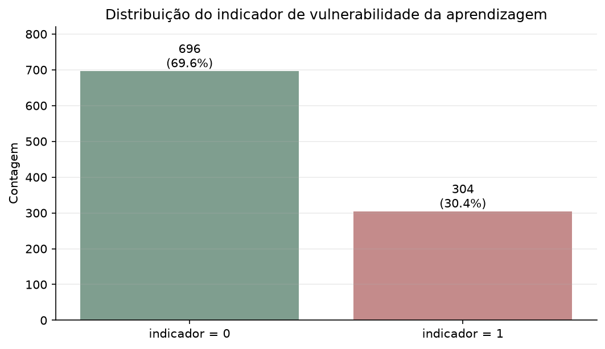
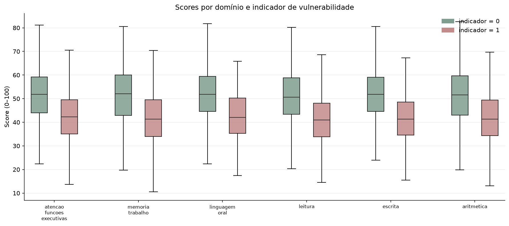
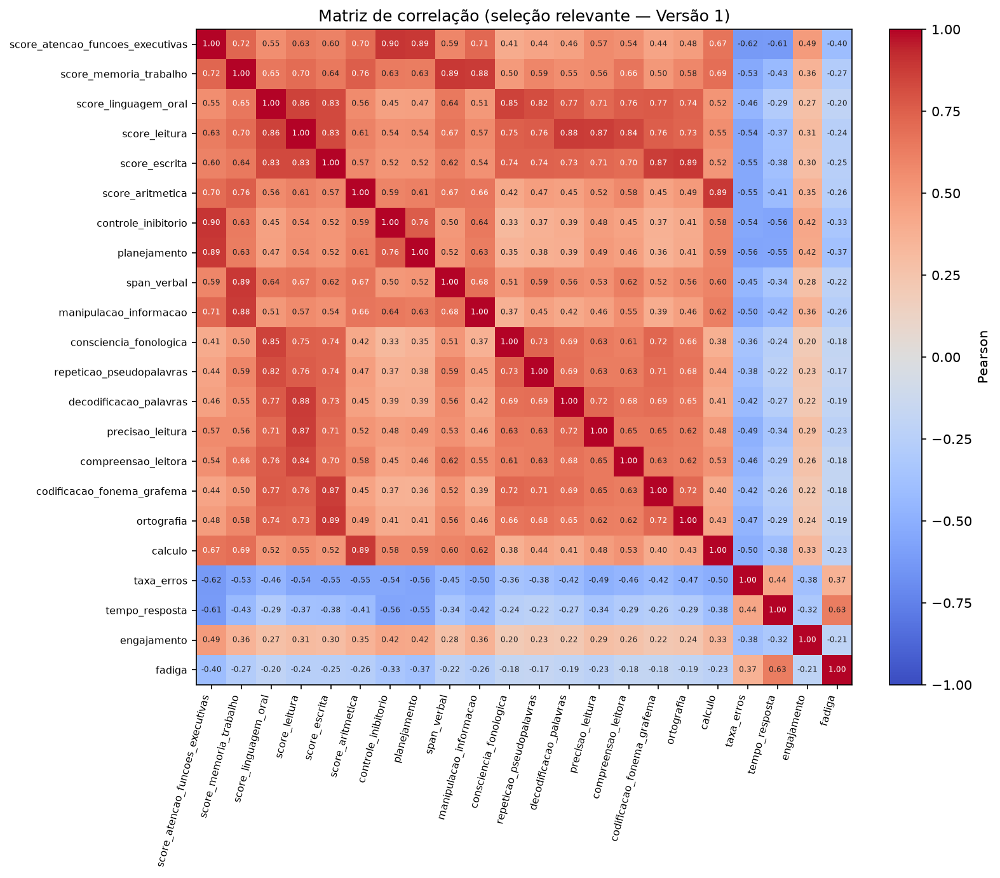
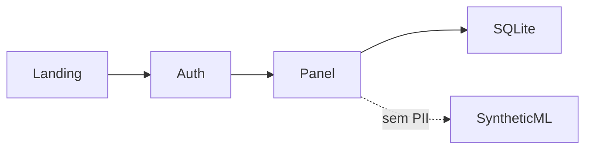

# NeuroLearn Analytics

Plataforma experimental de **gestão de avaliação e acompanhamento** para
Neuropsicopedagogia e Psicopedagogia — com prontuário longitudinal e um
laboratório de Data Science **sintético** separado.

> Projeto académico / portfólio. Não é dispositivo médico. Não realiza diagnóstico automático.


| | |
|---|---|
| Stack | Python · Flask · SQLAlchemy · Jinja2 · SQLite |
| DS | Pandas · NumPy · scikit-learn · Matplotlib |
| Testes | Pytest (50+ testes automatizados) |
| Licença | Not yet defined |

## Sobre o projeto

NeuroLearn organiza o percurso profissional:

**Anamnese → Avaliação → Perfil Cognitivo → Intervenção → Evolução**

Terminologia de interface configurável (Paciente / Aprendente / Avaliando).  
O model interno permanece `Patient` (legado de schema).

Documentação adicional:

- [Arquitetura](docs/ARCHITECTURE.md)
- [Data Science](docs/DATA_SCIENCE.md)
- [Portfólio / entrevista](docs/PORTFOLIO.md)
- [Guia de screenshots](docs/SCREENSHOTS.md)
- [Release notes v1](docs/RELEASE_NOTES_V1.md)
- [Deployment (futuro)](docs/DEPLOYMENT.md)

## Problema

Falta de uma estrutura única, longitudinal e ética para anamneses, avaliações,
resultados manuais e evolução — sem confundir apoio analítico com diagnóstico.

## Solução

Aplicação Flask autenticada com prontuário como eixo temporal, seed demo
reproduzível e pipeline ML **apenas** sobre dados sintéticos.

## Interface


Mais capturas (avaliação, intervenção, mobile): [docs/PORTFOLIO.md](docs/PORTFOLIO.md).

## Principais funcionalidades

### IMPLEMENTADO

- Landing + login/logout (CSRF, password hash)
- Dashboard acionável
- Pacientes/aprendentes, responsáveis, pesquisa/filtros/paginação
- Anamneses configuráveis (incl. Neuroeducacional V2 por secções)
- Planos, sessões, instrumentos, avaliações
- Perfil cognitivo + timeline unificada
- Devolutiva, intervenção, evolução
- Encaminhamentos, contactos escolares, documentos demo
- UX: breadcrumbs, badges, empty states, confirmações, print CSS
- Seed demo idempotente (`DEMO-001`…`DEMO-008`)
- Pipeline ML sintético (`main.py`)

### PLANEADO

- Relatórios avançados
- Hardening de produção (HTTPS, CSP, rate limit) — ver [DEPLOYMENT.md](docs/DEPLOYMENT.md)
- PostgreSQL (se houver deploy real)
- Exportações / PDF (sem assinar digital nesta fase)

## Fluxo profissional

```
Anamnese → Planeamento → Sessões → Avaliação → Perfil
        → Devolutiva → Intervenção → Evolução
```

Caso demo completo: **DEMO-001 · Lara Mendes** (fictício).

## Data Science







O laboratório gera features neuroeducacionais sintéticas, corre EDA e avalia
modelos supervisionados/não supervisionados **no conjunto sintético**.

**O ML não analisa pacientes reais.**  
Detalhes: [docs/DATA_SCIENCE.md](docs/DATA_SCIENCE.md).

```bash
python main.py
```

## Arquitetura



Ver [docs/ARCHITECTURE.md](docs/ARCHITECTURE.md).

## Stack

| Camada | Tecnologias |
|--------|-------------|
| Web | Python, Flask, Flask-Login, Flask-WTF, Jinja2, HTML/CSS/JS |
| Dados app | Flask-SQLAlchemy, SQLite (dev/demo) |
| DS | NumPy, Pandas, scikit-learn, Matplotlib |
| Qualidade | Pytest |

## Segurança

### Implementado

- Password hashing (Werkzeug)
- Autenticação + proteção de rotas
- CSRF (Flask-WTF)
- Isolamento por `professional_id`
- Cookies HttpOnly + SameSite (Secure configurável)
- Mutações via POST
- Páginas 403 / 404 / 500 sem traceback ao utilizador

### Produção / planeado

- HTTPS obrigatório
- CSP / rate limiting / auditoria / backups
- Política formal LGPD
- `SECRET_KEY` forte (já **obrigatória** se `FLASK_ENV=production`)

Não afirmamos “100% LGPD compliant”.

## Como executar

```bash
# 1. Ambiente
python -m venv .venv
# Windows: .venv\Scripts\activate
source .venv/bin/activate

# 2. Dependências
pip install -r requirements.txt

# 3. Config local
cp .env.example .env
# Ajuste SECRET_KEY se partilhar o ambiente

# 4. Seed demo (idempotente)
python scripts/seed_demo.py

# 5. App (desenvolvimento)
python app.py
# → http://127.0.0.1:8080
```

Produção: **não** use o servidor de desenvolvimento do Flask.
Requisitos futuros: [docs/DEPLOYMENT.md](docs/DEPLOYMENT.md).

## Conta demo

| Campo | Valor |
|-------|--------|
| Email | `demo@neurolearn.local` |
| Password | `Demo@12345` |
| Caso | `DEMO-001` Lara Mendes |

**DEVELOPMENT ONLY.** Nunca ative `NEUROLEARN_SEED_DEMO` em produção pública.

### Reset demo (manual e seguro)

1. Parar a app
2. Apagar o SQLite local (`data/processed/neurolearn_platform.db` — no `.gitignore`)
3. `python scripts/seed_demo.py`
4. Reiniciar a app

## Testes

```bash
pytest
```

Suite com **50+ automated tests** (auth, CSRF, isolamento, fluxos clínicos demo, UX).

## Estrutura

```
app.py                 # Application factory + landing
main.py                # Pipeline ML sintético
scripts/seed_demo.py   # Seed idempotente
src/platform/          # Plataforma profissional
src/*.py               # Data Science sintético
templates/             # Jinja (landing + painel)
static/                # CSS / JS / img
docs/                  # Arquitetura, DS, portfólio, screenshots
reports/figures/       # Figuras EDA
tests/                 # Pytest
```

## Limitações

- Sem diagnóstico / scoring clínico automático / IA
- SQLite não é arquitetura final de produção
- Instrumentos: metadados (sem itens proprietários)
- Demo fictícia — não uso clínico real
- Licença do repositório ainda não definida

## Roadmap

1. Relatórios profissionais
2. Hardening de deploy ([DEPLOYMENT.md](docs/DEPLOYMENT.md))
3. PostgreSQL (se necessário)
4. Exportações controladas

## Disclaimer

Projeto académico/portfólio. Não substitui julgamento profissional.  
Não é dispositivo médico. Dados sintéticos não constituem evidência clínica.  
Conteúdo de demonstração é 100% fictício.

## Licença

License: Not yet defined
