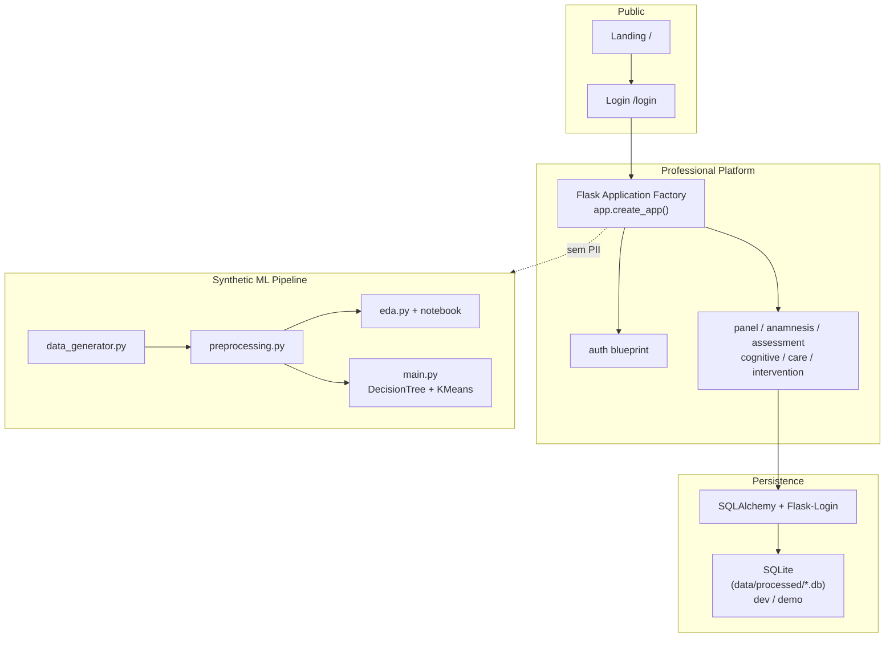

# Arquitetura — NeuroLearn Analytics

Visão técnica da aplicação Flask e do pipeline de Data Science sintético.

## Separação fundamental

| Camada | Conteúdo | Dados |
|--------|----------|-------|
| **Plataforma profissional** | Prontuário, auth, UX | Identificáveis (demo fictícios) |
| **Experimento Data Science** | EDA, classificação, clustering | **Apenas sintéticos** |

```
PLATAFORMA PROFISSIONAL  ≠  EXPERIMENTO DATA SCIENCE
```

O ML **não** lê a base de pacientes.

## Diagrama (Mermaid)



## Fluxo de pedido (plataforma)

```
Browser
  → Flask (create_app)
  → Blueprint autenticado (/panel/...)
  → SQLAlchemy models
  → SQLite (desenvolvimento)
```

## Módulos principais (`src/platform/`)

| Módulo | Responsabilidade |
|--------|------------------|
| `auth_routes` | Login / logout |
| `panel_routes` | Dashboard, pacientes, ficha |
| `anamnesis_*` | Templates e preenchimento dinâmico |
| `assessment_*` | Instrumentos e avaliações |
| `cognitive_*` | Perfil cognitivo e timeline helpers |
| `care_flow_*` | Planos, sessões, encaminhamentos |
| `intervention_*` | Devolutiva, intervenção, evolução |
| `seed` / `demo_seed` | Dados fictícios idempotentes |
| `schema_utils` | Migração leve SQLite |

## Persistência

- **SQLite** é a escolha atual para desenvolvimento e demonstração local.
- Adequado a portfólio; **não** é a arquitetura final obrigatória.
- Evolução possível (roadmap): PostgreSQL em produção.

## Configuração

| Ambiente | `FLASK_ENV` | Seed demo | `SECRET_KEY` |
|----------|-------------|-----------|--------------|
| development | `development` | default on | fallback local OK |
| testing | via `create_app(testing=True)` | off nos testes | testing |
| production | `production` | **default off** | **obrigatória** |

## Segurança (camada app)

Implementado: hashing, sessão, CSRF, isolamento `professional_id`, cookies HttpOnly/SameSite, mutações via POST.

Não implementado nesta fase: HTTPS forçado, CSP completa, rate limiting, auditoria formal, backups geridos.

## Seed

```bash
python scripts/seed_demo.py
```

Idempotente. Conta `demo@neurolearn.local` só para desenvolvimento.
