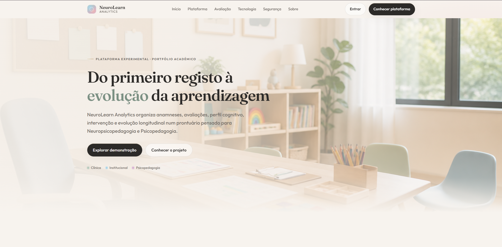
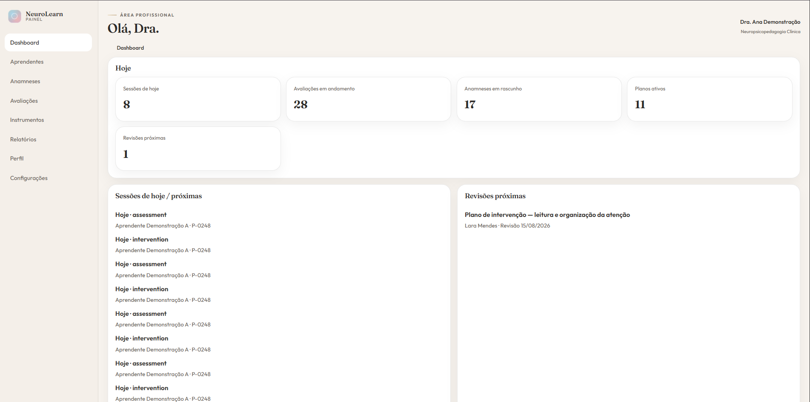
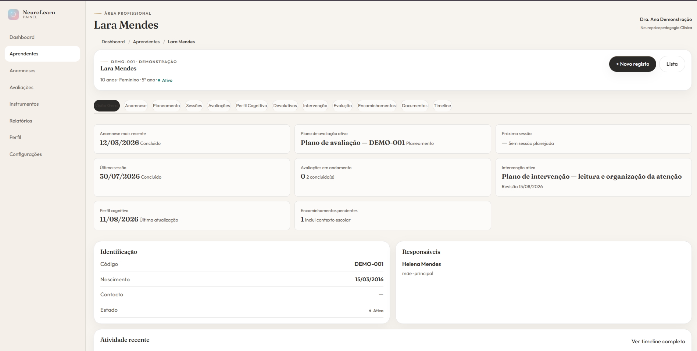
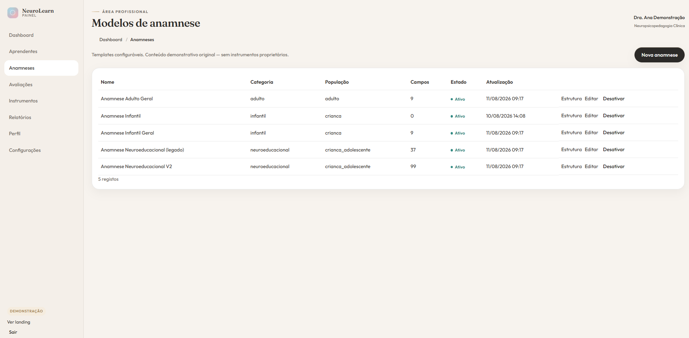
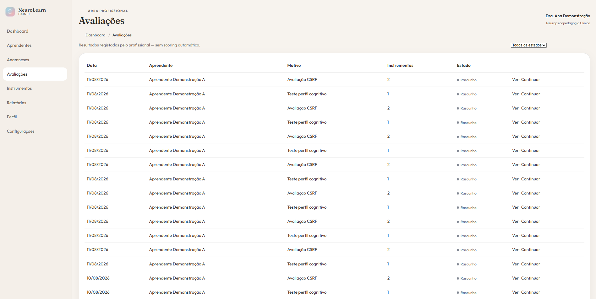
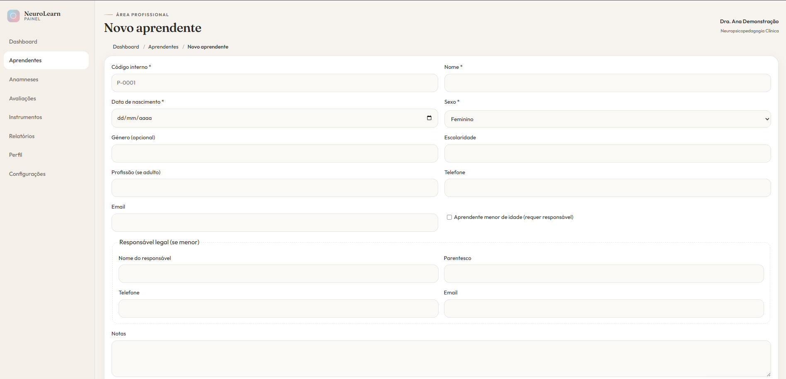
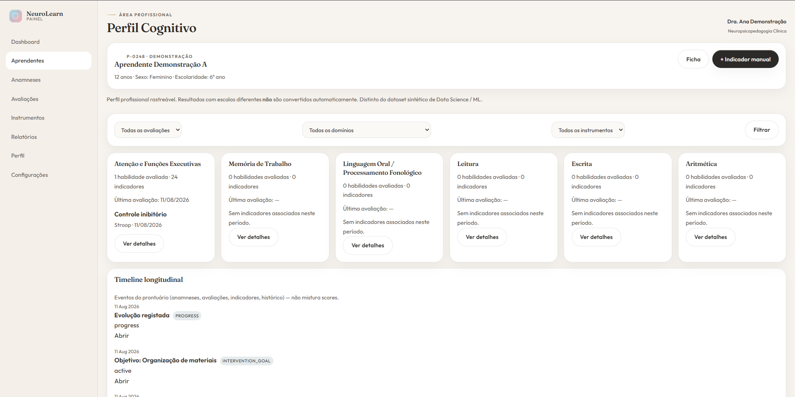
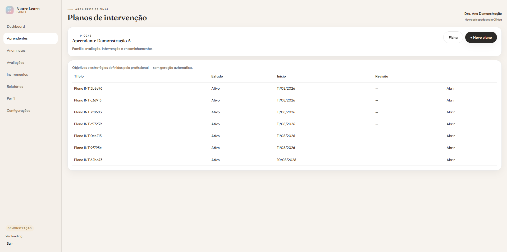
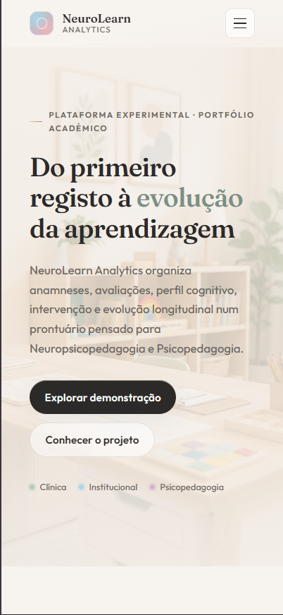

# Portfólio — NeuroLearn Analytics

Documento para apresentação académica / recrutamento.  
Tom profissional. Sem métricas inventadas nem utilizadores reais.

## Projeto

**NeuroLearn Analytics** é uma plataforma experimental Flask que organiza o
percurso profissional em Neuropsicopedagogia e Psicopedagogia — anamnese,
avaliação, perfil cognitivo, intervenção e evolução — com um laboratório de
Data Science **sintético** separado.

## Problema

Informação clínica/educacional dispersa; risco de misturar apoio analítico com
diagnóstico automático; falta de um prontuário longitudinal ético para
demonstração técnica.

## Minha abordagem

1. Começar pelo **prontuário** (não pelo ML).
2. Separar rigidamente PII demo do pipeline sintético.
3. Linguagem prudente (sem diagnóstico automático).
4. Segurança básica desde cedo (auth, CSRF, isolamento).
5. UX consolidada antes de novos módulos.

## Decisões técnicas

| Decisão | Motivo |
|---------|--------|
| Flask + blueprints | Clareza modular para portfólio |
| SQLAlchemy + SQLite | Setup local rápido; migração leve |
| Templates Jinja | UI server-rendered coerente |
| Seed idempotente | Demo reproduzível |
| sklearn só em `main.py` | ML não toca no prontuário |

## Arquitetura

Ver [ARCHITECTURE.md](ARCHITECTURE.md).  
Resumo: Landing → Auth → Panel → SQLAlchemy ←≠→ Synthetic ML.

## Segurança

Implementado: password hash, login, CSRF, isolamento `professional_id`, cookies
cuidadosamente configurados, mutações POST.

Não afirmado: conformidade LGPD certificada, HTTPS de produção, auditoria completa.

## UX

Ficha como centro; timeline unificada; anamnese V2 por secções; paginação;
breadcrumbs; empty states; confirmações seletivas.

## Screenshots

Todas as capturas usam a conta **DEMO** (`demo@neurolearn.local` /
Dra. Ana Demonstração) e códigos fictícios. Sem dados reais.

*Entrada pública do portfólio — marca, proposta de valor e CTAs para a demo.*

*Painel acionável: sessões do dia, rascunhos e revisões próximas (dados fictícios).*

*Gestão de aprendentes — pesquisa por nome/código e filtros de estado/idade.*

*Templates configuráveis (até ~99 campos na V2) sem instrumentos proprietários.*

*Avaliações manuais — sem scoring clínico automático.*

*Criação de aprendente com responsável legal (quando menor) — fluxo demo.*

*Indicadores por domínio e linha do tempo unificada no caso demo.*

*Objetivos e estratégias manuais — sem geração automática por ML.*

*Primeiro ecrã responsivo — navegação hamburger e CTAs empilhados.*

## Data Science

Ver [DATA_SCIENCE.md](DATA_SCIENCE.md).  
Dataset sintético, EDA, Decision Tree, KMeans — resultados **não clínicos**.

## Desafios

- Modelar prontuário longitudinal sem over-engineering
- Preservar sistema dinâmico de anamnese (~99 campos) com UX utilizável
- Evitar N+1 e manter testes verdes
- Comunicar limites éticos sem enfraquecer a demonstração técnica

## O que aprendi

- Separação de contextos (produto vs laboratório) é uma decisão de produto
- UX de dados sensíveis exige hierarquia e empty states, não só CRUD
- Seed rico vale mais que features incompletas numa entrevista

## Próximos passos (honestos)

- Relatórios / exportações
- Hardening de produção (HTTPS, CSP, rate limit) — ver [DEPLOYMENT.md](DEPLOYMENT.md)
- PostgreSQL se houver deploy real
- **Não** planeado como próximo passo: IA diagnóstica

